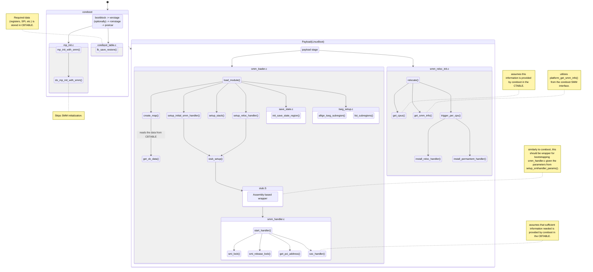
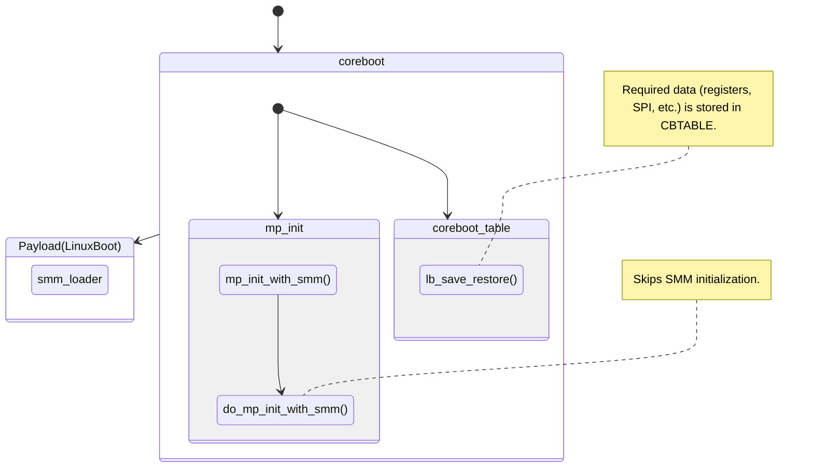

# Transitioning SMM Ownership to Linuxboot

This repo contains the background of the problem, results of the research on existing implementations in coreboot and EDK2, the design of the proposed solution, and its implementation (PoC). 

## Tables of contents
 - [Background on SMM](#background-on-smm)
 - [Overview of coreboot SMM initialization](#overview-of-coreboot-smm-initialization)
 - [Overview of EDK2 SMM initialization](#overview-of-edk2-smm-initialization)
 - [Roadmap](#roadmap)
 - [WIP: Proposed design architecture](#proposed-design-architecture)
 - [WIP: Proof of Concept](#proof-of-concept)
 - [References](#references)

## Background on SMM
System Management Mode (SMM) is a special purpose mode for handling the system-wide functions, intended to be used only by system firmware, hence not accessible for the operating system or its applications. \
SMM can be only invoked through System Management Interrupt (SMI) - either through SMI# pin on the processor or through a SMI message via APIC bus. SMI is nonmaskable, that is, it cannot be disabled/ignored by the processor,
and operates independently from the processor's interrupt and exception handling. When SMI is received, the processor saves the current context in SMRAM, enters SMM and starts executing the SMI handler. Once in SMM, the processor signals
external hardware about handling SMI, the implementation of signaling is platform dependent and hence omitted here. Exiting from SMM can only be done by executing RSM instruction, available to the SMI handler. RSM
restores the previous processor's context back to the registers from the save state image from the SMRAM. Please note that the description given here is brief, for detailed description, please refer to Intel's developer manual for IA-32/64
architecture, (Volume 3C, Chapter 33) [[1]](#1).

### SMRAM
The above mentioned SMRAM is a address space to which the processor switches when entering SMM. All memory addresses become mapped to the low 4GB's of the physical address space. The critical code and data of SMI handler 
resides in SMRAM. There is a pre-defined region within SMRAM - the State Save Area - where the per-SMI context is saved. The default size of SMRAM is 64 KB starting from the physical address called SMBASE. The SMBASE default value is 30000H, and 
the State Save Area begins at SMBASE + 8000H + 7FFFH to SMBASE + 8000H + 7E00H in IA-32 processors that does not support Intel 64 architecture and SMBASE + 8000H + 7FFFH to SMBASE + 8000H + 7C00H. The processor looks for the SMI handler instructions at addresses starting from SMBASE + 8000H. In general, the size of SMRAM can be between 32KB and 4GB. For the details on registers
stored in State Save Area, please refer to Intel's developer manual for IA-32/64 architecture, (Volume 3C, Chapter 33.4) [[1]](#1). When running on multiprocessor systems, each processor needs its own SMRAM space, and while there can be an overlap of the memory space,
each processor needs its own State Save Area. This can be done There are no restrictions on how many processors can excute in SMM at given time. The following table shows how SMRAM is divided up in Intel 64 architecture multiprocessor systems.
|      SMRAM             | Address  |
|------------------------|----------|
| Monitor segment (MSEG) | [30000H]  |
| common SMI handler     | [SMBASE+8000H] -> [SMBASE+8000H+7E00H] |
| CPU 0 code segment     | [SMBASE+8000H+7E00H] |
| CPU 1 code segment     |    ->     |
| ...                    |    ->       |
| CPU n code segment     | -> [SMBASE + 8000H + 7E00H] |
| Stacks                 |  [SMBASE + 8000H + 7E00H] -> (up to) [SMBASE+ 8000H + FFFF8000H] |

### SMBASE Relocation
As mentioned above, the base address for SMRAM is 30000H (default SMBASE). Software can relocate the SMRAM by setting SMBASE field in the saved state map (7EF8H) to the new value. The SMBASE register is reloaded by the RSM instruction on each SMM exit, which results in the following SMI requests to use the new SMBASE value. On multiprocessor systems, SMBASE Relocation is used to adjust 
ensure the SMBASE for each CPU is different so that State Save Areas do not overlap.

## Overview of coreboot SMM initialization
coreboot, if built for x86, takes care of initializing SMM. When HAVE_SMI_HANDLER is set to "y" (which is the case for most of the supported x86 boards), source files responsible for SMM init ```src/cpu/x86/smm``` are compiled as part of ramstage class [[2]](#2), [[3]](#3).
The ramstage is one of the multiple coreboot stages that are each compiled as separate binaries and compressed into CBFS. ramstage is responsible for main device init, so i.a. SMM init [[4]](#4). The coreboot stages are shown at Fig. 1.
<figure>
  
  <figcaption>Figure 1: coreboot - Platform Initialization Stages<a href=#4>[4]</a>CC-by 4.0 the coreboot project</figcaption>
</figure>

The ```src/cpu/x86/smm``` consists of:
 - **save_state.c** - defines 4 functions:
    - ```init_save_state()```: determines which operational structure to use for the save state based on the system's revision number, by iterating through the list of available predefined operation structures and checking their supported revision numbers.
    - ```get_apmc_node(u8 cmd)```: returns the CPU node which issued an APMC IO write (Advanced Power Management Control register).
    - accessors for SMM save state CPU registers RAX, RBX, RCX and RDX [[5]](#5), ```get_save_state_reg(const enum cpu_reg reg, const int node, void *out, const uint8_t length)``` and ```get_save_state_reg(const enum cpu_reg reg, const int node, void *out, const uint8_t length)```.
 - **smm_module_handler.c** - C-based SMM runtime handler which consists of the following functions:
    - ```smi_obtain_lock()```: fuction to aquire lock to ensure only one processor can execute the handler.
    - ```smi_release_lock()```: used to release the previously aquired lock.
    - ```smm_get_smmstore_com_buffer(uintptr_t *base, size_t *size)```: getter for the location of the SMMSTORE (see section on [SMMSTORE](#smmstore)).
    - ```smm_get_cbmemc_buffer(void **buffer_out, size_t *size_out)```: getter for the location of the CBMEM Console buffer [[6]](#6) in SMM mode.
    - ```is_trap_handler(int smif)```: a handler for IO trap which passes the handling of IO trap to appropriate handler for given SoC through `mainboard_io_trap_handler(int smif)` and returns non-zero value if this handler function handled given IO trap without errors
    - ```smi_backup_pci_address```: backing up PCI address under u32 int variable pci_orig in case OS needs it later.
    - ```smi_restore_pci_address()```: restore previously backed up PCI address.
    - ```*smm_get_save_state(int cpu)```: getter for save state of given processor.
    - ```smm_revision()```: retuns the SMM save state Revision from the SMM save state, which is always at the same pre-defined offset downward from the top of the save state, that is: ```save_state + save_state_size - SMM_REVISION_OFFSET_FROM_TOP```.
    - ```smm_region_overlaps_handler(const struct region *r)```: for checking whether region pointed to by `r` overlaps with the memory reserved for SMM.
    - ```smm_handler_start(void *arg)```: used to execute the handler. The flow of the function is as follows: it checks whether the lock can be obtained and waits if not, back's up the PCI address, and executes the SoC specific SMI handlers in order to allow the SMM Relocation handlers in SoC specific modules to be executed.
    This is required on multiprocessor systems to adjust SMBASE value for each (logical) processor so that the SMRAM state save areas for each processor do not overlap.
 - **smm_module_loader.c** - component responsible for loading the complete SMM module into the memory, that is, the SMM initialization is done using the functions provided by this source file. These are:
    - ```smm_create_map(const uintptr_t smbase, const unsigned int num_cpus, const struct smm_loader_params *params)```: creates map of all the CPU entry points, save state locations and beginning and end of code segments for each CPU. This map is used during relocation to properly align as many CPUs that can fit into the SMRAM region.
    It checks when a code segent is full and begins placing the reminder CPUs in the lower segments. Used to assure that save state area of different CPUs do not overlap.
    - ```smm_get_cpu_smbase(unsigned int cpu_num)```: getter for SMBASE address of given CPU
    - ```smm_place_entry_code(const unsigned int num_cpus)```: responsible for placing the init code for each CPUs, that is, the SMM Stub code from smm_stub.S
    - ```smm_setup_stack(const uintptr_t perm_smbase, const size_t perm_smram_size, const unsigned int total_cpus, const size_t stack_size)```: sets up the stack memory for all CPUs by checking whether the provided stack size is large enough, checking whether the provided stack size if assign to each available CPU will fit the SMRAM. Finally it sets the top address of the stack.
    - ```smm_stub_place_staggered_entry_points(const struct smm_loader_params *params)```: places the staggered entry points for each CPU, these points are staggered by the save state size per CPU extending down from SMM_ENTRY_OFFSET (8000H).
    - ```smm_module_setup_stub(const uintptr_t smbase, const size_t smm_size, struct smm_loader_params *params)```: sets up the stub. It relies on SMM map to avoid the save state areas overlapping with the stub.
    - ```smm_setup_relocation_handler(struct smm_loader_params *params)```: performs parameters checks, that is, it checks whether there is no more than 1 concurrent save state for the relocation handler, whether the handler is defined, and whether the number of CPUs is set. Afterwards, the parameters are passed by to the `smm_module_setup_stub`.
    - ```setup_smihandler_params(struct smm_runtime *mod_params, struct smm_loader_params *loader_params)```: assigns SMI handler parameters based on the build configuration, current SMRAM region's base address and size, and provided structure with parameters (`smm_loader_params`).
    - ```print_region(const char *name, const struct region region)```: prints informations about the memory region.
    - ```append_and_check_region(const struct region smram, const struct region region, struct region *region_list, const char *name)```: used to append the region list with a new region after checking whether given region is a subregion of SMRAM (i.e. it lies withing SMRAM), and whether there are no overlaps with previous regions on the region list.
    - ```install_page_table(const uintptr_t handler_base)```: sets up the page table entries and returns the address of the lop-level page table entry in page map level-4 entry.
    - ```smm_load_module(const uintptr_t smram_base, const size_t smram_size, struct smm_loader_params *params)```: places the complete SMM module by calling the above discussed functions in the provided region as show in the table below.
        | SMM module      ||
        |-----------------|-----------------| 
        |---------------------------------|<- smram + size|
        | BIOS resource list (STM)      |
        |---------------------------------||
        |  smi handler    ||
        |      ...        ||
        |                 ||
        |  page tables    ||
        |---------------------------------| <- cpu0|
        |    stub code    | <- cpu 1|
        |    stub code    | <- cpu 2|
        |    stub code    | <- cpu 3|
        |      ...        | <- cpu n|
        |    stacks       | 
        |---------------------------------|<- smram start |

 - **smm_stub.S** - a generic wrapper for bootstrapping a C-based SMM handler, it puts the CPU into the protected mode with a stack and calls into the C handler (smm_module_handler.c)
 - **tseg_region.c** - used for aligning the region in the Top of Low Memory Segment (TSEG) for SMM. Based on the values of SMM_TSEG and SMM_ASEG from the build configuration, the start and size of the region are alligned for either TSEG or ASEG. Note that ASEG is deprecated and only used for QEMU emulation target.
 - **pci_resource_store.c** - compiled if SMM_PCI_RESOURCE_STORE is set to "y" - not the case by default, currently only enabled for Intel Xeon SP SoC's and AMD SoC's that require AMD common XHCI support. Support for storing PCI resources in SMRAM allows SMM to tell whether they have been altered. Functions defined
 here are:
    - ```smm_pci_resource_store_init(struct smm_runtime *smm_runtime)```: initializes PCI store within the runtime
    - ```smm_pci_resource_store_fill_resources(struct smm_pci_resource_info *slots, size_t num_slots, const struct device **devices, size_t num_devices)```: stores the devices info within the PCI resource store
    - ```smm_pci_get_stored_resources(const volatile struct smm_pci_resource_info **out_slots, size_t *out_size)```: getter function for stored info

### SMBASE Relocation
When coreboot is built for multiprocessor system, with PARALLEL_MP set to "y", the `src/cpu/x86/mp_init.c` is compiled into ramstage. The MP initialization defines two classes of processors, the bootstrap (BSP) and application (AP) processors. After each power-up or RESET of an MP system, one of the processors is being selected as BSP
and the remaining ones are designated as APs. After selection, the BSP executes BIOS bootstrap code. We omit the detailed description of usual MP initialization protocol, and focus on describing how coreboot approaches SMBASE relocation once APs receive SIPI. For more details on MP init we refer to coreboot's and Intel's documentations [[10]](#10), [[11]](#11).
The function related to SMM are:
 - `smm_initiate_relocation_parallel()`: used to send SMI to self without any serialization. 
 - `smm_initiate_relocation()`: used to send SMI to self with single execution.
 - `is_smm_enabled()`: returns true if [HAVE_SMI_HANDLER ∧ mp_state.do_smm] is true.
 - `smm_disable()`: setter for mp_state.do_smm
 - `smm_enable()`: setter for mp_state.do_smm, under condition that HAVE_SMI_HANDLER flag is set to "y".
 - `smm_do_relocation(void *arg)`: used to compute the location of the new SMBASE.
 - `install_relocation_handler(int num_cpus, size_t save_state_size)`: when X86_SMM_SKIP_RELOCATION_HANDLER flag in the build configuration is not enabled, it will call `smm_setup_relocation_handler()` (see above) with provided number of CPUs and save state size, new SMBASE location (computed with `smm_do_relocation()`) and value stored in CR3 register.
 - `install_permantent_handler(int num_cpus, uintptr_t smbase, size_t smsize, size_t save_state_size)`: upon execution, all CPUs will relocate to the permanent handler. This function sets parameters needed for all CPUs, and simply provides beginning of SMRAM region, number of CPUs using the handler, save state and stack sizes for each CPU.
 - `load_smm_handlers()`: used to load SMM handlers as a part of MP init. If SMM is enabled, it first sets up the stacks (see `smm_setup_stack()` description above) and installs SMM relocation and permanent handlers. Finally it indicates in mp_state structure that SMM handlers have been loaded.
 - `trigger_smm_relocation()`: used to trigger SMM as a part of MP init. Checks whether SMM is enabled and only triggers SMM mode for the current CPU if this is the case.
 - `fill_mp_state_smm(struct mp_state *state, const struct mp_ops *ops)`:
 - `do_mp_init_with_smm(struct bus *cpu_bus, const struct mp_ops *mp_ops)`: the mp_ops argument is used to drive the multiprocess initialization. The sequence of operations is the following:
    1. pre_mp_init()
    2. get_cpu_count()
    3. get_smm_info()
    4. get_microcode_info()
    5. adjust_cpu_apic_entry() for each number of get_cpu_count()
    6. pre_mp_smm_init()
    7. per_cpu_smm_trigger() in parallel for all cpus which calls relocation_handler() in SMM.
    8. mp_initialize_cpu() for each cpu
    9. post_mp_init()
 - `mp_init_with_smm(struct bus *cpu_bus, const struct mp_ops *mp_ops)`: calls `do_mp_init_with_smm()` and returns error in case of the call resulting in an error. 

### SMMSTORE
SMMSTORE, or SMMSTOREv2, are SMM mediated drivers to read from write to and erase a predefined region in the flash. This can be used by the OS or the payload to implement persistent storage to hold for instance configuration data, without needing to implement a (platform specific) storage driver in the payload itself.
For more details about actual implementation of SMMSTORE and SMMSTOREv2, we refer to coreboot's documentation [[7]](#), [[8]](#).

## Overview of EDK2 SMM initialization
EDK2 implements the SMM initialization as specified in UEFI PI Specification [[12]](#12), that is, it implements SMM Initial Program Loader (IPL) which loads SMM into SMRAM and then starts SMM services. This takes place in the Driver Execution Phase Environment (DXE) stage of EDK2. Stages of EDK2 are shown in Fig. 2.
<figure>
  
  <figcaption>Figure 2: EDK2 stages - Platform Initialization Stages<a href=#4>[4]</a>, CC-by 4.0 the coreboot project</figcaption>
</figure>

SMM initialization in EDK2 makes use of interfaces defined by UEFI PI specs:
 - **EFI_MM_ACCESS_PROTOCOL** (previously **EFI_SMM_ACCESS2_PROTOCOL** deprecated with UEFI PI 1.5 spec): used to describe the different SMRAM regions available in the system.
 - **EFI_MM_CONTROL_PROTOCOL** (previously **EFI_SMM_CONTROL2_PROTOCOL** deprecated with UEFI PI 1.5 spec): used to initiate synchronous SMIs.
 - **EFI_MM_CONFIGURATION_PROTOCOL** (previously **EFI_SMM_CONFIGURATION_PROTOCOL** deprecated with UEFI PI 1.5 spec): indicates which areas within SMRAM are reserved.
 - **EFI_MM_BASE_PROTOCOL** (previously **EFI_SMM_BASE2_PROTOCOL** deprecated with UEFI PI 1.5 spec): used to locate System Management System Table (SMST) during SMM driver initialization. SMTS is a set of services and data that are designed to provide a basic services for SMM drivers.

These modules are used to initialize SMM for SMM drivers in the DXE phase. The SMM foundation will load all of the SMM drivers, and these drivers will register SMI handlers to service synchronous or asynchronous SMI activations [[13]](#13).\
The source files with drivers used in EDK2 are under ```MdeModulePkg/Core/PiSmmCore```, and consist of:
- **PiSmmIpl**: A DXE driver that loads SMM foundation driver. Consists of following functions:
    - `SmmBase2InSmram(IN CONST EFI_SMM_BASE2_PROTOCOL  *This, OUT BOOLEAN *InSmram)`: used to indicate whether the driver is currently executing in the SMM Initialization phase.
    - `SmmBase2GetSmstLocation(IN CONST EFI_SMM_BASE2_PROTOCOL *This, OUT EFI_SMM_SYSTEM_TABLE2 **Smst)`: used to retrieve the location of SMST.
    - `SmmCommunicationCommunicate(IN CONST EFI_SMM_COMMUNICATION_PROTOCOL *This, IN OUT VOID *CommBuffer, IN OUT UINTN *CommSize OPTIONAL)`: responsible for communication with registered handler, provides service to send and receive messages from a registered UEFI service. 
    - `SmmCommunicationMmCommunicate2(IN CONST EFI_MM_COMMUNICATION2_PROTOCOL  *This, IN OUT VOID *CommBufferPhysical, IN OUT VOID *CommBufferVirtual, IN OUT UINTN *CommSize OPTIONAL)`: s.a.
    - `SmmIplSmmConfigurationEventNotify(IN EFI_EVENT Event, IN VOID *Context)`: used to notify the event of *gEfiSmmConfigurationProtocol* installation.
    - `SmmIplReadyToLockEventNotify(IN EFI_EVENT Event, IN VOID *Context)`: used to notify the event of DxeSmmReadyToLock protocol is addition or if *gEfiEventReadyToBootGuid* is signalled.
    - `SmmIplDxeDispatchEventNotify(IN EFI_EVENT Event, IN VOID *Context)`: used to notify the event of DxeDispatch Event Group signal.
    - `SmmIplGuidedEventNotify(IN EFI_EVENT Event, IN VOID *Context)`: used to notify the event of GUIDed Event Group signal. 
    - `SmmIplEndOfDxeEventNotify(IN EFI_EVENT  Event, IN VOID *Context)`: used to notify the event EndOfDxe Event Group signal. 
    - `SmmIplSetVirtualAddressNotify(IN EFI_EVENT Event, IN VOID *Context)`: a notification function registered on EVT_SIGNAL_VIRTUAL_ADDRESS_CHANGE event. 
    - `GetSmramCacheRange(IN EFI_SMRAM_DESCRIPTOR  *SmramRange, OUT EFI_PHYSICAL_ADDRESS  *SmramCacheBase, OUT UINT64 *SmramCacheSize)`: used to search and joint all adjacent ranges of SmramRange into a range to be cached.
    - `GetPeCoffImageFixLoadingAssignedAddress(IN OUT PE_COFF_LOADER_IMAGE_CONTEXT  *ImageContext)`: getter for the fixed loading address from image header assigned by build tool (EDK2 specific).
    - `ExecuteSmmCoreFromSmram(IN OUT EFI_SMRAM_DESCRIPTOR  *SmramRange, IN OUT EFI_SMRAM_DESCRIPTOR  *SmramRangeSmmCore, IN VOID *Context)`: used to load the SMM Core image into SMRAM and executing it from SMRAM.
    - `SmmSplitSmramEntry(IN OUT EFI_SMRAM_DESCRIPTOR *RangeToCompare, IN OUT EFI_SMM_RESERVED_SMRAM_REGION  *ReservedRangeToCompare, OUT EFI_SMRAM_DESCRIPTOR *Ranges, IN OUT UINTN *RangeCount, OUT EFI_SMM_RESERVED_SMRAM_REGION  *ReservedRanges, IN OUT UINTN *ReservedRangeCount, OUT EFI_SMRAM_DESCRIPTOR *FinalRanges, IN OUT UINTN *FinalRangeCount)`:
    used to split SMRAM (see section on SMRAM).
    - `SmmIsSmramOverlap(IN EFI_SMRAM_DESCRIPTOR *RangeToCompare, IN EFI_SMM_RESERVED_SMRAM_REGION *ReservedRangeToCompare)`: checks for overlap of SMRAM regions.
    - `GetFullSmramRanges(OUT UINTN *FullSmramRangeCount)`: getter for SMRAM ranges.
    - `SmmIplEntry(IN EFI_HANDLE ImageHandle, IN EFI_SYSTEM_TABLE *SystemTable)`: main entry point for SMM IPL, loads SMM Core into SMRAM, registers SMM Core entry point for SMIs, installs SMM Base2 and SMM Communication Protocols, and registers the critical events for coordination between DXE and SMM environments.

 - **PiSmmCore**: The SMM foundation driver, responsible for loading various SMM drivers, hence managing their dependencies, and providing services to them. Upon received SMI, it is responsible for determining which SMM handler to call. Consists of the following functions:
    - `SmmEfiNotAvailableYetArg5()`: placeholder function until all SMM system table services are available, should never be executed in the normal circumstances.
    - `SmmLegacyBootHandler(IN EFI_HANDLE  DispatchHandle, IN CONST VOID  *Context OPTIONAL, IN OUT VOID *CommBuffer OPTIONAL, IN OUT UINTN *CommBufferSize  OPTIONAL)`: SMI handler that is called when a Legacy Boot event is signalled. The SMM
  Core uses this signal to know that a Legacy Boot has been performed and that
  `gSmmCorePrivate` (a physical pointer to the private structure shared between IPL and Core) that is shared between the UEFI and SMM execution environments can not be accessed from SMM anymore since that structure is considered free memory by a legacy OS. 
  Then the SMM Core also install SMM Legacy Boot protocol to notify SMM driver that system enter legacy boot.
    - `SmmExitBootServicesHandler(IN EFI_HANDLE  DispatchHandle, IN CONST VOID  *Context OPTIONAL, IN OUT VOID  *CommBuffer OPTIONAL, IN OUT UINTN *CommBufferSize  OPTIONAL)`: SMI handler that is called when an Exit Boot Services event is signalled, installs SMM Exit Boot Services protocol to notify the SMM driver of exiting boot services.
    - `SmmS3EntryCallBack(IN EFI_HANDLE  DispatchHandle, IN CONST VOID *Context OPTIONAL, IN OUT VOID *CommBuffer OPTIONAL, IN OUT UINTN *CommBufferSize  OPTIONAL)`: main entry point for an SMM handler dispatch or communicate-based callback when on S3 resume path.
    - `SmmReadyToBootHandler(IN EFI_HANDLE  DispatchHandle, IN CONST VOID *Context OPTIONAL, IN OUT VOID *CommBuffer OPTIONAL, IN OUT UINTN *CommBufferSize  OPTIONAL)`: SMI handler that is called when an Ready To Boot event is signalled, installs SMM Ready To Boot protocol to notify SMM driver that system is ready to boot. 
    - `SmmReadyToLockHandler(IN EFI_HANDLE  DispatchHandle, IN CONST VOID  *Context OPTIONAL, IN OUT VOID *CommBuffer OPTIONAL, IN OUT UINTN *CommBufferSize  OPTIONAL)`: SMI handler that is called in two cases: when *DxeSmmReadyToLock* protocol is added, or if *gEfiEventReadyToBootGuid* event is signalled. Responsible for deregistering not required SMIs after SMRAM is locked, and for installing SMM Ready to Lock protocol to inform SMM drivers about SMRAM being locked.
    - `SmmEndOfDxeHandler(IN EFI_HANDLE  DispatchHandle, IN CONST VOID  *Context OPTIONAL, IN OUT VOID *CommBuffer OPTIONAL, IN OUT UINTN *CommBufferSize  OPTIONAL)`: SMI handler that is called when EndOfDxe is signalled. Installs SMM EndOfDxe Protocol to inform SMM drivers that DXE stage ended.
    - `SmmS3SmmInitDoneHandler(IN EFI_HANDLE  DispatchHandle, IN CONST VOID  *Context OPTIONAL, IN OUT VOID *CommBuffer OPTIONAL, IN OUT UINTN *CommBufferSize  OPTIONAL)`: SMI handler that is called when S3SmmInitDone is signalled (i.e. SMM initialization is finished on S3 resume path). Installs SMM S3SmmInitDone Protocol to notify SMM drivers that SMM S3 initialization is done. 
    - `SmmEndOfS3ResumeHandler(IN EFI_HANDLE  DispatchHandle, IN CONST VOID  *Context OPTIONAL, IN OUT VOID *CommBuffer OPTIONAL, IN OUT UINTN *CommBufferSize  OPTIONAL)`: SMI handler that is called when the EndOfS3Resume is signalled. Installs the SMM EndOfS3Resume Protocol to notify SMM Drivers that S3 resume has finished.
    - `InternalIsBufferOverlapped(IN UINT8  *Buff1, IN UINTN  Size1, IN UINT8  *Buff2, IN UINTN  Size2)`: helper func for determining whether two buffers overlap in memory.
    - `SmmEntryPoint(IN CONST EFI_SMM_ENTRY_CONTEXT  *SmmEntryContext)`: main entry point to SMM Foundation, only used by SMRAM invocation.
    - `SmmCoreInstallLoadedImage()`: responsible for installing LoadedImage Protocol - a protocol that is used to describe an Image that has been loaded into the memory.
    - `SmmMain(IN EFI_HANDLE ImageHandle, IN EFI_SYSTEM_TABLE  *SystemTable)`: main entry point for SMM Core, responsible for installing DXE protocols, reloading SMM Core into SMRAM, and registering SMM Core EntryPoint on the SMI vector.

The SMM driver that performs SMM initialization and provides CPU specific services (similarly to `mp_init.c` for coreboot), finds itself under `UefiCpuPkg/PiSmmCpuDxeSmm.c` consists of the following functions:
- `IsSmmProfileEnabled()`: checker for the SmmProfile value.
- `PerformRemainingTasks()`: checks whether SMM Ready to Lock flag is true, and if so performs the following: starts SMM Profile (if enabled by config), checks whether all APs (see section on SMBASE Relocation) enter SMM, sets up the page table for later usage by the OS, configures SMM Code Access Check (if available) and sets SMM Ready to Lock flag back to false.
- `GetSmiCommandPort()`: getter for system port address of the SMI command port in FADT (Fixed ACPI Description Table).
- `SmmReadyToLockEventNotify(IN CONST EFI_GUID *Protocol, IN VOID *Interface, IN EFI_HANDLE Handle)`: notification handler for SMM Ready to Lock event.
- `GetSmmCpuSyncConfigData(IN OUT BOOLEAN *RelaxedMode OPTIONAL, IN OUT UINT64  *SyncTimeout OPTIONAL, IN OUT UINT64  *SyncTimeout2 OPTIONAL)`: getter for *SmmCpuSyncConfig* data.
- `GetAcpiS3EnableFlag()`: getter for ACPI S3 flag.
- `GetSupportedMaxLogicalProcessorNumber()`: getter for the maximum nr. of logical CPUs supported by the system.
- `GetMpInformationFromMpServices(OUT UINTN *NumberOfCpus, OUT UINTN *MaxNumberOfCpus)`: getter for number active of CPUs and maximum number of CPUs and *EFI_PROCESSOR_INFORMATION* for all CPUs.
- `PiCpuSmmEntry(IN EFI_HANDLE ImageHandle, IN EFI_SYSTEM_TABLE  *SystemTable)`: main entry point for the CPU SMM driver, responsible for saving the memory encryption address from Platform Configuration Data into a global variable, installing SMM Configuration Protocol in the handle database, and registering SMM Ready to Lock Protocol notification.

## Roadmap
Please see [LinuxBootSMM roadmap](https://github.com/orgs/9elements/projects/35).

## [WIP] Proposed design architecture
The existing solution for moving the SMM ownership to EDK2 payload [[14]](#14) distinguishes two boot paths [[15]](#15) which require different approaches, these boot paths are: S0 boot - a basic boot path "boot with full configuration", i.e. usual power-up, and S3 Resume - "save to RAM resume", the system configuration is saved and system is placed in S3 "sleep" state, during the S3 resume phase the firmware loads the saved state.
Issues introduced by these two boot paths mentioned in the documentation are:
 - **S0 boot**: Payloads shall **not** be silicon dependent, hence firmware (coreboot), must provide the payload with silicon specific register definitions. This issue was solved by providing these, as well as SPI layout, using the coreboot table (cbtable). The exact definitions are available given in the source file and omitted here [[14]](#14). 
 - **S3 boot**: On the S3 boot path, the payload execution is skipped, hence the minimal relocation has to be done by coreboot. The initial 4k of SMRAM containing software SMI number and SMBASE addresses for CPUs is preserved. coreboot then, performs SMM relocation and triggers payloads' software SMI.
 
For the purpose of moving the SMM ownership to LinuxBoot payload, we follow-up on the same idea, that is, the slightly modified SMM payload "interface" on the coreboot side will be used. Given the interface being initially designed to work with ED2 payload, some adjustments will be required. The high-level overview of the flow for S0 and S3 are shown in Fig. 3 and Fig. 4 respectively.


<figcaption>Figure 3: S0 boot path SMM initialization flow</figcaption>


<figcaption>Figure 4: S3 Resume boot path SMM initialization flow</figcaption>


## [WIP] Proof of Concept
For the instructions on the usage, please refer to LinuxBootSMM-builder's [README](https://github.com/micgor32/linuxbootsmm-builder/blob/master/README.md).

## References
<a id="1">[1]</a> [Intel® 64 and IA-32 Architectures Software Developer Manuals, Volume 3C, Ch. 33](https://www.intel.com/content/www/us/en/developer/articles/technical/intel-sdm.html) \
<a id="2">[2]</a> [Linux Kernel Makefiles](https://www.kernel.org/doc/html/v6.14-rc1/kbuild/makefiles.html) \
<a id="3">[3]</a> [The coreboot build system](https://doc.coreboot.org/getting_started/build_system.html) \
<a id="4">[4]</a> [coreboot architecture - ramstage](https://doc.coreboot.org/getting_started/architecture.html#ramstage) \
<a id="5">[5]</a> [Intel® 64 and IA-32 Architectures Software Developer Manuals, Volume 1, Ch. 3.](https://www.intel.com/content/www/us/en/developer/articles/technical/intel-sdm.html) \
<a id="6">[6]</a> [coreboot FAQ - What does coreboot leave in memory after it's done initializing the hardware](https://doc.coreboot.org/getting_started/faq.html#what-does-coreboot-leave-in-memory-after-it-s-done-initializing-the-hardware) \
<a id="7">[7]</a> [SMM based flash storage driver](https://doc.coreboot.org/drivers/smmstore.html) \
<a id="8">[8]</a> [SMM based flash storage driver version 2](https://doc.coreboot.org/drivers/smmstorev2.html) \
<a id="9">[9]</a> [A Tour Beyond BIOS Implementing UEFI Authenticated Variables in SMM with EDKII](https://raw.githubusercontent.com/tianocore-docs/Docs/master/White_Papers/A_Tour_Beyond_BIOS_Implementing_UEFI_Authenticated_Variables_in_SMM_with_EDKII_V2.pdf) \
<a id="10">[10]</a> [coreboot - Multiple Processor (MP) Initialization](https://doc.coreboot.org/soc/intel/mp_init/mp_init.html) \
<a id="11">[11]</a> [Intel® 64 and IA-32 Architectures Software Developer Manuals, Volume 3A, Ch. 8.4](https://www.intel.com/content/www/us/en/developer/articles/technical/intel-sdm.html) \
<a id="12">[12]</a> [UEFI PI Specification 1.9, Volume 4](https://uefi.org/sites/default/files/resources/UEFI_PI_Spec_Final_Draft_1.9.pdf) \
<a id="13">[13]</a> [A Tour Beyond BIOS Launching Standalone SMM Drivers in PEI using the EFI Developer Kit II](https://github.com/vincentjzimmer/Documents/blob/master/A_Tour_Beyond_BIOS_Launching_Standalone_SMM_Drivers_in_PEI_using_the_EFI_Developer_Kit_II.pdf) \
<a id="14">[14]</a> [70378: drivers/smm_payload_interface: Add initial support for SMM payload](https://review.coreboot.org/c/coreboot/+/70378) \
<a id="15">[15]</a> [10. Boot Paths - UEFI PI Specification](https://uefi.org/specs/PI/1.8/V1_Boot_Paths.html#boot-paths) \
